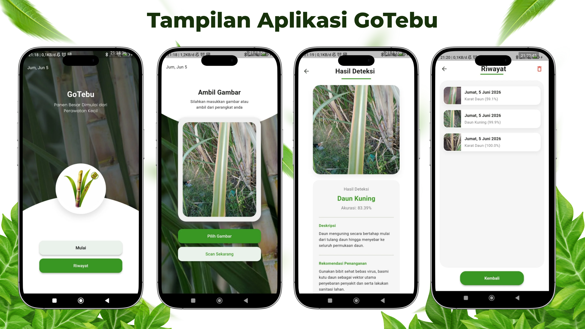
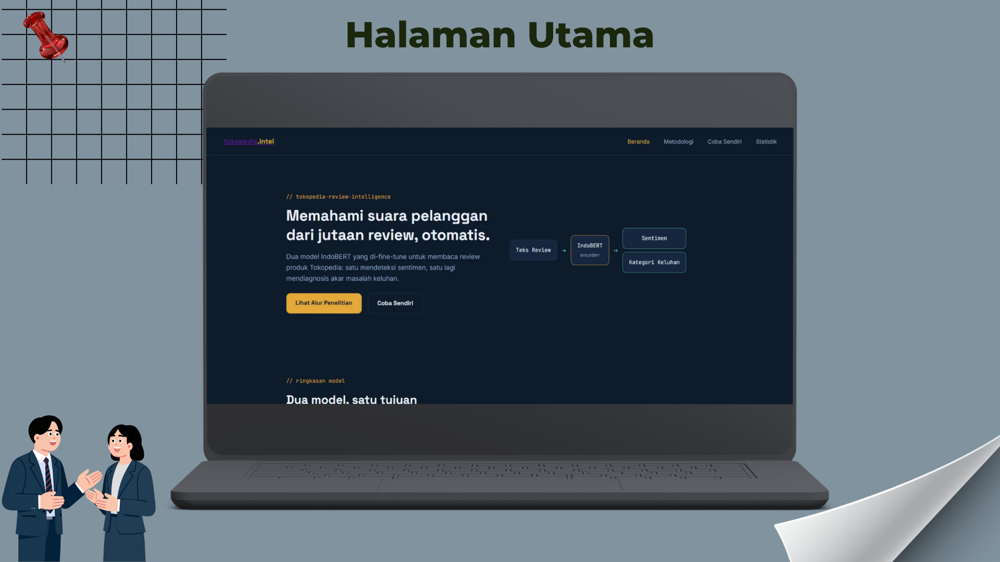
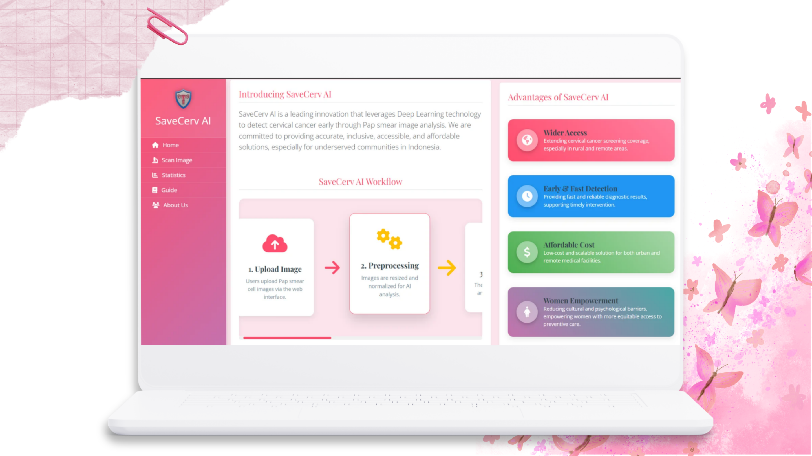

 

  

  

 

**↓ keep scrolling, the story continues below ↓**

 

# 🧭 Chapter 1 — Character Profile

Fresh graduate dengan fokus pada **Data Science**, **Deep Learning**, dan **Computer Vision**, IPK **3.90/4.00** dari D4 Manajemen Informatika, Universitas Negeri Surabaya.

Berpengalaman membangun model klasifikasi penyakit tanaman menggunakan **DenseNet201** yang diaplikasikan dalam bentuk mobile app, serta sistem analisis sentimen review Tokopedia menggunakan model **IndoBERT** yang disajikan dalam bentuk web dashboard interaktif.

Terampil mengolah data dan membangun model deep learning yang aplikatif menggunakan **Python**, **TensorFlow**, dan **NumPy**.

 

### ⚡ Quick Stats

<table align="center">
<tr>
<td align="center" width="25%">

<h4>AI</h4>
Computer Vision NLP
</td>
<td align="center" width="25%">

<h4>Python</h4>
TensorFlow Keras
</td>
<td align="center" width="25%">

<h4>Deployment</h4>
Flutter Flask
</td>
<td align="center" width="25%">

<h4>Achievement</h4>
97% Accuracy 1.18M Reviews
</td>
</tr>
</table>

 

# ⚔️ Chapter 2 — Skill Tree

<table align="center">
<tr>
<td align="center" width="16%"> <b>Language</b> Python</td>
<td align="center" width="16%"> <b>Deep Learning</b> TensorFlow · Keras · Transfer Learning</td>
<td align="center" width="16%"> <b>NLP</b> IndoBERT · Sentiment Analysis</td>
<td align="center" width="16%"> <b>Deployment</b> Flask · Streamlit · TFLite · Flutter</td>
<td align="center" width="16%"> <b>Data</b> Pandas · NumPy · Scikit-learn · Excel</td>
<td align="center" width="16%"> <b>Tools</b> Git · Jupyter · Anaconda · Looker Studio</td>
</tr>
</table>

 

# 🏆 Chapter 3 — Quests Completed

<table>
<tr>
<td width="50%">

## 🌿 Quest: Sistem Deteksi Penyakit Daun Tebu
`Tugas Akhir` · Juli 2026

Model klasifikasi penyakit daun tebu berbasis **DenseNet201 (Transfer Learning)** dengan **11 kelas**, menggunakan gabungan dua dataset publik serta *class weighting* untuk mengatasi ketidakseimbangan data.

Mencapai akurasi **97%** pada **2.231 data uji**, lalu di-deploy menggunakan **TensorFlow Lite** pada aplikasi **Flutter** — inferensi berjalan offline langsung di perangkat pengguna.

**Loot:** `Python` `TensorFlow` `Keras` `DenseNet201` `TensorFlow Lite` `Flutter`

</td>
<td width="50%"></td>
</tr>
</table>

---

<table>
<tr>
<td width="50%">

## 🛒 Quest: Tokopedia Review Intelligence
Juli 2026

Pipeline **NLP** menggunakan **IndoBERT** pada **1,18 juta** review produk Tokopedia, dengan dua model yang di-*fine-tune* terpisah untuk analisis sentimen dan klasifikasi keluhan multi-label.

Model sentimen mencapai akurasi **73,2%**, model klasifikasi keluhan memperoleh **F1-micro 0,80**. Hasil disajikan lewat dashboard interaktif berbasis **Flask** untuk membantu identifikasi isu pelanggan.

**Loot:** `Python` `IndoBERT` `Flask` `Pandas`

</td>
<td width="50%"></td>
</tr>
</table>

---

<table>
<tr>
<td width="50%">

## 🩺 Quest: SaveCerv AI
`Tim` · Intel® AI Global Impact Festival · Juli 2025

Berkontribusi mengembangkan sistem klasifikasi citra Pap smear menggunakan **MobileNetV2 (Transfer Learning)** untuk mengidentifikasi **5 kategori sitologi**, akurasi **90%** pada data uji.

Aplikasi web berbasis **Flask** dan **Streamlit** untuk analisis citra real-time, dilengkapi confidence score dan dashboard statistik kanker serviks nasional maupun global.

**Loot:** `Python` `TensorFlow` `MobileNetV2` `Flask` `Streamlit`

</td>
<td width="50%"></td>
</tr>
</table>

 

# 🛡️ Chapter 4 — Guild Experience

## 🏢 Badan Pusat Statistik Kabupaten Trenggalek
**Pengolahan Data** · 📅 Januari 2025 – Juli 2025

- Mengembangkan web scraping menggunakan **Python** dan **Selenium** untuk mengumpulkan data 1.500+ sekolah jenjang PAUD hingga SMA se-Kabupaten Trenggalek, diekspor otomatis ke Excel untuk mempercepat proses entry data dan profiling sekolah oleh petugas.
- Merancang visualisasi data dan dashboard pendataan administrasi Desa Dawuhan, Kecamatan Trenggalek menggunakan **Looker Studio**, mendukung publikasi data yang transparan dan mudah diakses publik.
- Merancang visualisasi data berbasis Excel untuk mempermudah penyusunan dan penyajian data statistik pada publikasi *"Kabupaten Trenggalek Dalam Angka 2025"*.
- Membangun sistem antrian layanan publik berbasis web menggunakan **Laravel 10**, mendigitalisasi proses pengelolaan kunjungan masyarakat yang sebelumnya manual menjadi lebih terstruktur dan efisien.
- Melakukan entry dan rekapitulasi berita seputar Kabupaten Trenggalek secara berkala untuk mendukung dokumentasi dan arsip informasi daerah.

 

# 🎓 Chapter 5 — Training Grounds

<table>
<tr>
<td width="70%">

## Universitas Negeri Surabaya
Sarjana Terapan Manajemen Informatika
📅 2022 – 2026 · 🎓 IPK **3.90 / 4.00**

</td>
<td align="center">
🎓 <b>Program Dicoding for University</b> Data Science Track
</td>
</tr>
</table>

 

# 🏅 Chapter 6 — Achievements Unlocked

<table>
<tr>
<td align="center" width="33%">

<h4>TensorFlow</h4>Google
 <a href="./assets/sertifikasi/tensorflow.pdf">View</a>
</td>
<td align="center" width="33%">

<h4>Data Science</h4>Dicoding
 <a href="./assets/sertifikasi/dicoding.pdf">View</a>
</td>
<td align="center" width="33%">

<h4>🔒 Coming Soon</h4>More...
</td>
</tr>
</table>

 

# 🎯 Chapter 7 — Side Quest

**PKM Center UNESA (2024)**
Berkontribusi meningkatkan tingkat keberhasilan proposal Program Kreativitas Mahasiswa (PKM) yang didanai dari **7,2%** pada tahun 2023 menjadi **9,6%** pada tahun 2024, melalui koordinasi administrasi dan penyebaran informasi kepada peserta.

 

# 📊 Chapter 8 — Stat Screen

  

 

# 📌 Chapter 9 — Trophy Case

 

 

# 🐍 Chapter 10 — The Snake Boss

 

# 🎮 Chapter 11 — Bonus Level: Fun Zone

 

# 📬 Final Chapter — Join My Party

Open to **Data Science**, **Machine Learning Engineer**, dan **AI/NLP** roles.

  

> *"Good models don't just achieve high accuracy. They create real impact."*

**Ridhwan Fachrul Arief**

